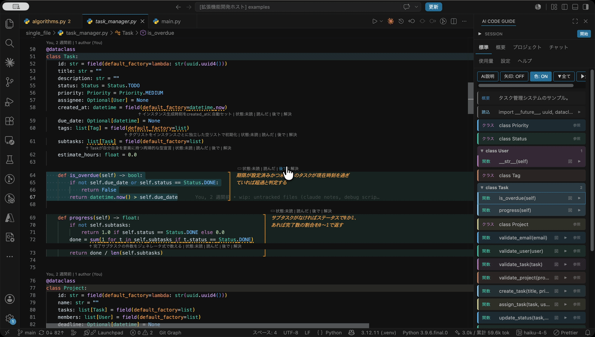
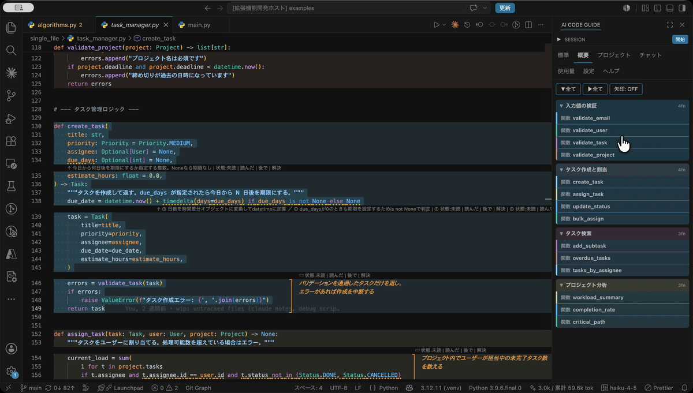
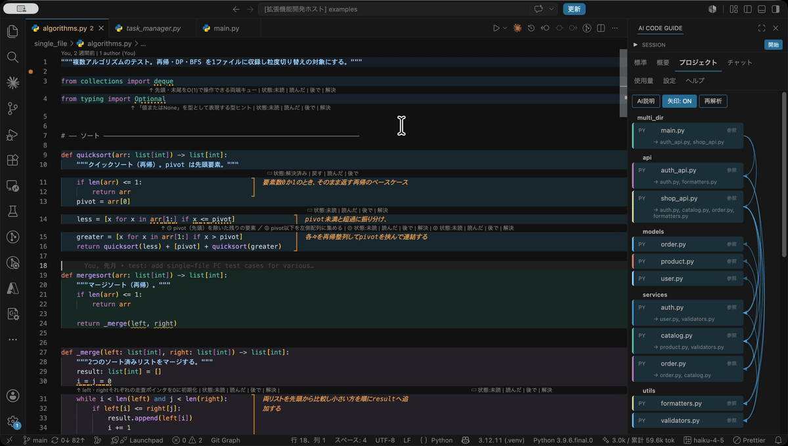

# AI Code Guide — デモで見る3機能

**AIが書いたPythonコードを「調べずに読める」ようにするVSCode拡張。** 構造はフローチャートとマップで見て、非自明な箇所はコードの上に出るAI解説で読む。

実際の操作画面（GIF・各10〜15秒）で3機能を紹介します。
Discord・Slack 等で共有する場合は、[docs/assets/](assets/) にある同名の **MP4 版**（高解像度・各1.5〜2MB）をそのまま添付してください。

---

## ① フローチャート × エディタ連動

**クリックでコードと図が相互ジャンプ。関数単位の制御フロー図にもドリルインできる。**



- エディタの行をクリック → サイドバーの対応カードがハイライト
- カードをクリック → エディタが対応行へジャンプ
- 関数カードの「図」→ その関数の制御フロー図（分岐・例外・return）
- 「概要」タブ → 関数を意味のまとまりでグループ化した粗い粒度に切替

## ② プロジェクトビュー（import 依存マップ）

**プロジェクト全体の import 依存を矢印で一望し、カードから各ファイルへ移動できる。**



- ワークスペース内の全Pythonファイルをディレクトリ単位のカードで表示
- 「矢印: ON」で import 依存の矢印を重ね描き
- カードをクリック → そのファイルがエディタで開く（開いたファイルにも①③がそのまま使える）

## ③ インライン意味解説

**AIが「説明が必要な箇所」だけを選び、コードの上に解説を重ねる。ホバーで詳細。**



- 知らないメソッド・非自明な書き方 → 点線下線＋直下に短い解説
- 複数行のまとまり → 箱枠＋右余白のサイドノート
- ホバー → 「なぜこう書くか」まで踏み込んだ詳細説明
- 行ごとの逐語訳ではなく、LLMが1ファイルあたり数箇所を厳選する

---

## 導入方法

```bash
git clone <このリポジトリ>
cd ai-code-guide
./install.sh   # バンドル → .vsix 作成 → VS Code へインストールまで一発
```

インストール後、Pythonファイルを開いてサイドバーの「AI CODE GUIDE」から使えます。
`claude` / `codex` CLI にログイン済みならAPIキー不要で動きます。

詳しい使い方・設定・アンインストール方法は [HOWTO.md](../HOWTO.md) を参照してください。
